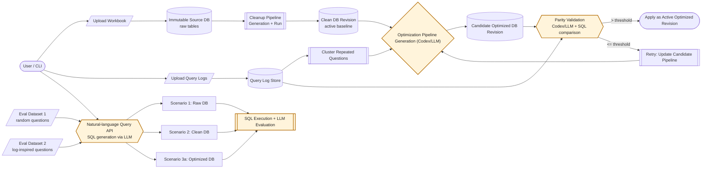

# self-updating-database

Docs-first TypeScript monorepo for a self-updating database product.

## CLI-first workflow

Start the API server first:

```bash
pnpm dev:api
```

Then use the CLI:

```bash
pnpm cli <command>
```

### Core flow

1. Upload source workbook:

```bash
pnpm cli upload workbook apps/web/fixtures/demo-workbooks/retailer-transactions-demo.xlsx
```

2. Upload dummy query logs:

```bash
pnpm cli upload query-logs <datasetId> apps/web/fixtures/demo-workbooks/retailer-transactions-demo-query-logs.xlsx
```

3. Trigger cleaning pipeline:

```bash
pnpm cli pipeline run <datasetId>
```

4. Trigger optimization pipeline:

```bash
pnpm cli optimization run <datasetId>
```

Pin optimization to a specific active cleaned baseline revision:

```bash
pnpm cli optimization run <datasetId> --base-pipeline-version-id <pipelineVersionId>
```

### System diagram



Scenario mapping: Scenario 1 queries the immutable raw DB, Scenario 2 queries the active clean DB revision, and Scenario 3a queries the active optimized DB revision.

### Node deep dives

#### Cleanup pipeline generation + run

- Purpose: turn messy uploaded sheets into a consistent queryable version.
- What it changes: naming and formatting consistency (for example column names and categorical values).
- What it does not change: the source database is immutable, and business meaning should not be rewritten.
- Precision rule: values are kept at full precision (no rounding in the pipeline).
- Outcome: a clean database revision becomes the active baseline for querying and later optimization.

#### Cluster repeated questions

- Purpose: identify where users ask the same kind of question repeatedly.
- How grouping works conceptually: each historical query is reduced to an intent pattern (which entities it touches, how data is filtered, whether it is detail vs aggregate, and how it groups/sorts).
- Literal values (specific dates, SKUs, store ids) are treated as parameters, so queries with the same structure but different values still land in the same cluster.
- Ranking logic: clusters are prioritized by repeated usage and total latency impact, so frequent slow patterns rise to the top.
- Why this matters: optimization focuses on recurring, expensive query patterns instead of one-off queries.
- Outcome: a short ranked list of high-impact query groups for the optimization cycle.

#### Optimization pipeline generation (Codex/LLM)

- Purpose: propose a better derived schema for the current clean baseline.
- Inputs: top repeated-question clusters, current pipeline, schema context, and validation feedback from prior attempts.
- Conceptual strategy: redesign the derived schema so common questions are easier for an LLM to translate into correct SQL on the first try.
- Typical improvements: clearer table/column naming, reusable rollup objects for common grains, and explicit metric semantics (for example gross vs net and return handling).
- Decision mode: choose either `pipeline_revision` (make a meaningful structural change) or `no_change` (when extra complexity would not produce clear value).
- Expected behavior: make meaningful structural improvements when justified, or explicitly keep the pipeline unchanged when not justified.
- Key guardrail: trivial/no-op proposals are rejected when there is clear optimization demand.
- Outcome: a candidate optimized pipeline, with an explanation of what changed and optimization hints for downstream SQL generation.

#### Candidate optimized DB revision build

- Purpose: materialize the proposed optimization into a real database revision.
- Process: validate the candidate pipeline, build a candidate database, and keep it isolated from the active revision.
- Promotion rule: candidate stays “temporary” until parity checks pass.

#### Parity validation (Codex/LLM + SQL comparison)

- Purpose: verify that optimization does not break answer correctness.
- Core check: replay historical benchmark questions on the candidate DB and compare outputs to expected answers from the baseline.
- Comparison style: semantic equivalence (content-level), not brittle formatting-level equality.
- Pass/fail: candidate must exceed the configured pass ratio threshold.
- If failing: diagnostics feed back into the next optimization attempt, and the loop retries up to the configured attempt limit.

#### Natural-language query API (SQL generation via LLM)

- Purpose: convert a user’s natural-language question into safe executable SQL.
- What the model sees: current schema, table profiles, column descriptions, and active optimization hints.
- Safety checks: generated SQL must be a single read-only query.
- Execution: run query against the selected scenario database and return rows/timing.
- Learning loop: query outcomes are logged and reused to improve future optimization cycles.

#### SQL execution + LLM evaluation

- Purpose: compare raw vs clean vs optimized behavior on shared test question sets.
- What is measured:
  - correctness (against ground truth)
  - SQL execution speed (average and median)
- How correctness is judged: both deterministic checks and LLM-based semantic review.
- Outputs: CSV/JSON artifacts with generated SQL, expected output, actual output, timing, and evaluation reasoning for auditability.

### Command reference

```bash
pnpm cli dataset list
pnpm cli dataset show <datasetId>
pnpm cli upload workbook <workbook.xlsx>
pnpm cli upload query-logs <datasetId> <query-logs.xlsx>
pnpm cli pipeline run <datasetId>
pnpm cli optimization run <datasetId>
pnpm cli optimization run <datasetId> --base-pipeline-version-id <pipelineVersionId>
pnpm cli optimization retry-latest-failed <datasetId>
pnpm cli status <datasetId>
pnpm cli status <datasetId> --watch --interval-ms 2000
pnpm cli events <datasetId>
pnpm cli query <datasetId> "show top 10 products by revenue"
```

API base URL defaults to `http://127.0.0.1:3001`.
Override with `--api-base-url <url>` or `API_BASE_URL`.

See detailed CLI notes in [docs/CLI.md](docs/CLI.md).

## Latest Eval Results (March 24, 2026)

Dataset: `dataset_ykadj93p`  
Model: `gpt-5.4-mini`  
Reasoning mode: `deliberate`  
Question sets: dataset 1 + dataset 2 (40 questions per scenario)

### Dataset 1 (random questions) summary

| Scenario                | Accuracy | Avg SQL execution time | Median SQL execution time |
| ----------------------- | -------- | ---------------------- | ------------------------- |
| `scenario_1_raw`        | `15/20`  | `23.429ms`             | `22.310ms`                |
| `scenario_2_clean`      | `14/20`  | `19.792ms`             | `18.876ms`                |
| `scenario_3a_optimized` | `15/20`  | `16.206ms`             | `15.881ms`                |

### Dataset 2 (log-inspired questions) summary

| Scenario                | Accuracy | Avg SQL execution time | Median SQL execution time |
| ----------------------- | -------- | ---------------------- | ------------------------- |
| `scenario_1_raw`        | `19/20`  | `11.855ms`             | `10.834ms`                |
| `scenario_2_clean`      | `20/20`  | `3.381ms`              | `3.056ms`                 |
| `scenario_3a_optimized` | `20/20`  | `1.533ms`              | `1.019ms`                 |

### Artifacts

- Raw dataset id: `dataset_ykadj93p`
- Cleaned pipeline version id: `pipeline_version_koulsetl` (clean DB id: `clean_db_2lrjtp54`)
- Optimized pipeline version id: `pipeline_version_5n9pv9xq` (clean DB id: `clean_db_fyu660ue`)
- Raw workbook: `apps/web/fixtures/demo-workbooks/retailer-transactions-demo.xlsx`
- Query logs workbook: `apps/web/fixtures/demo-workbooks/retailer-transactions-demo-query-logs.xlsx`
- Full benchmark CSV: `docs/reports/2026-03-24-eval/sql-benchmark-dataset_ykadj93p-full-deliberate-latest.csv`
- Full benchmark JSON: `docs/reports/2026-03-24-eval/sql-benchmark-dataset_ykadj93p-full-deliberate-latest.json`
- Applied optimized pipeline SQL:
  - `docs/reports/2026-03-24-eval/pipeline_version_5n9pv9xq.sql`

### Next steps / considerations

- Query clustering is based on generated SQL structure, so wrong generated SQL can steer optimization in the wrong direction.
- Optimization can introduce too many helper objects, which may make schema context harder for query generation models to navigate.
- Parity validation assumes benchmark logs are correct; if logs are wrong or ambiguous, the system can learn and reinforce incorrect behavior.
