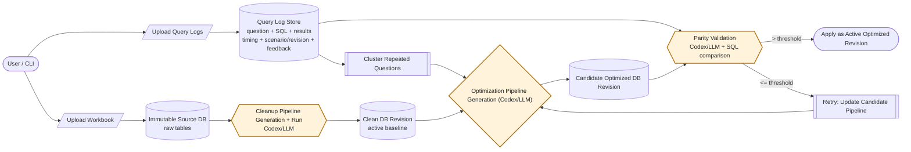
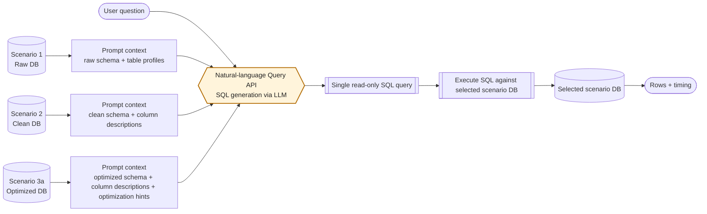

# self-updating-database

Docs-first TypeScript monorepo for a self-updating database product.

This repository is about two linked goals:

1. Update the derived query database over time so repeated query patterns become faster to answer.
2. Update that database in a way that still helps a SQL query agent stay accurate when turning natural-language questions into SQL.

## CLI-first workflow

Start the API server first:

```bash
pnpm dev:api
```

Then use the CLI:

```bash
pnpm cli <command>
```

### Core flow

1. Upload source workbook:

```bash
pnpm cli upload workbook apps/web/fixtures/demo-workbooks/retailer-transactions-demo.xlsx
```

2. Upload dummy query logs:

```bash
pnpm cli upload query-logs <datasetId> apps/web/fixtures/demo-workbooks/retailer-transactions-demo-query-logs.xlsx
```

3. Trigger cleaning pipeline:

```bash
pnpm cli pipeline run <datasetId>
```

4. Trigger optimization pipeline:

```bash
pnpm cli optimization run <datasetId>
```

Pin optimization to a specific active cleaned baseline revision:

```bash
pnpm cli optimization run <datasetId> --base-pipeline-version-id <pipelineVersionId>
```

### Database optimization flow



### Text-to-SQL generation flow



Scenario mapping: Scenario 1 queries the immutable raw DB, Scenario 2 queries the active clean DB revision, and Scenario 3a queries the active optimized DB revision.

Prompt construction differs by scenario: the raw path uses the raw schema and basic table profiles, the clean path adds cleaned naming and richer column descriptions, and the optimized path includes those column descriptions plus derived objects and optimization hints that explain which precomputed structures should be preferred when generating SQL.

The query log store is meant to keep the natural-language question, the generated SQL query, and the returned results, plus lightweight metadata such as timing, selected scenario or database revision, and evaluation or feedback signals that help rank repeated expensive patterns.

### Node deep dives

#### Cleanup pipeline generation + run

- **Purpose:** Turn messy uploaded sheets into a consistent queryable version.
- **Input:** Raw workbook-derived tables from the immutable source database plus the current cleanup pipeline definition.
- **Output:** A clean database revision that becomes the active baseline for querying and later optimization.
- **Logic:** Standardize naming and formatting consistency, keep values at full precision, and avoid rewriting the underlying business meaning because the source database remains immutable.

#### Cluster repeated questions

- **Purpose:** Identify where users ask the same kind of question repeatedly.
- **Input:** Historical query logs containing the natural-language question, generated SQL, returned results, and metadata such as usage frequency, timing, scenario, and revision context.
- **Output:** A short ranked list of high-impact query groups for the optimization cycle.
- **Logic:** Reduce each historical query to an intent pattern, treat literal values like dates or SKUs as parameters, and rank clusters by repeated usage plus latency impact so recurring expensive patterns rise above one-off questions.

#### Optimization pipeline generation (Codex/LLM)

- **Purpose:** Propose a better derived schema for the current clean baseline.
- **Input:** Top repeated-question clusters, the current pipeline, schema context, and validation feedback from prior attempts.
- **Output:** A candidate optimized pipeline plus an explanation of what changed and optimization hints for downstream SQL generation.
- **Logic:** Redesign the derived schema so common questions are easier for the LLM to translate into correct SQL, typically through clearer naming, reusable rollups, and explicit metric semantics; choose either `pipeline_revision` or `no_change`, while rejecting trivial no-op proposals when optimization demand is clear.

#### Candidate optimized DB revision build

- **Purpose:** Materialize the proposed optimization into a real database revision.
- **Input:** The candidate optimized pipeline and the active cleaned baseline data.
- **Output:** An isolated candidate optimized database revision that is ready for validation.
- **Logic:** Validate the candidate pipeline, build the candidate database, and keep it separate from the active revision until parity checks succeed.

#### Parity validation (Codex/LLM + SQL comparison)

- **Purpose:** Verify that optimization does not break answer correctness.
- **Input:** The candidate optimized database, historical benchmark questions, and expected answers from the baseline.
- **Output:** A pass/fail decision plus diagnostics that either allow promotion or guide the next retry.
- **Logic:** Replay benchmark questions against the candidate database, compare results semantically rather than by brittle formatting, require the pass ratio to exceed the configured threshold, and feed failures back into the next optimization attempt.

#### Natural-language query API (SQL generation via LLM)

- **Purpose:** Convert a user’s natural-language question into safe executable SQL.
- **Input:** The user question plus prompt context from the selected scenario database, including schema, profiles, descriptions, and any optimization hints.
- **Output:** A single read-only SQL query and the resulting rows and timing from the selected scenario database.
- **Logic:** Assemble scenario-specific prompt context, ask the LLM for a read-only query, enforce safety checks, execute against the selected database, and log the outcome so future optimization cycles can learn from the query pattern.

#### SQL execution + LLM evaluation

- **Purpose:** Compare raw vs clean vs optimized behavior on shared test question sets.
- **Input:** Shared benchmark questions, generated SQL, expected outputs, and execution results across the scenario databases.
- **Output:** CSV/JSON artifacts with generated SQL, expected output, actual output, timing, and evaluation reasoning for auditability.
- **Logic:** Measure correctness against ground truth plus semantic review, track SQL execution speed with average and median timing, and package the results so scenario behavior can be compared consistently over time.

### Command reference

```bash
pnpm cli dataset list
pnpm cli dataset show <datasetId>
pnpm cli upload workbook <workbook.xlsx>
pnpm cli upload query-logs <datasetId> <query-logs.xlsx>
pnpm cli pipeline run <datasetId>
pnpm cli optimization run <datasetId>
pnpm cli optimization run <datasetId> --base-pipeline-version-id <pipelineVersionId>
pnpm cli optimization retry-latest-failed <datasetId>
pnpm cli status <datasetId>
pnpm cli status <datasetId> --watch --interval-ms 2000
pnpm cli events <datasetId>
pnpm cli query <datasetId> "show top 10 products by revenue"
```

API base URL defaults to `http://127.0.0.1:3001`.
Override with `--api-base-url <url>` or `API_BASE_URL`.

See detailed CLI notes in [docs/CLI.md](docs/CLI.md).

## Latest Eval Results (March 24, 2026)

Dataset: `dataset_ykadj93p`  
Model: `gpt-5.4-mini`  
Reasoning mode: `deliberate`  
Question sets: dataset 1 + dataset 2 (40 questions per scenario)

### Dataset 1 (random questions) summary

| Scenario                | Accuracy | Avg SQL execution time | Median SQL execution time |
| ----------------------- | -------- | ---------------------- | ------------------------- |
| `scenario_1_raw`        | `15/20`  | `23.429ms`             | `22.310ms`                |
| `scenario_2_clean`      | `14/20`  | `19.792ms`             | `18.876ms`                |
| `scenario_3a_optimized` | `15/20`  | `16.206ms`             | `15.881ms`                |

### Dataset 2 (log-inspired questions) summary

| Scenario                | Accuracy | Avg SQL execution time | Median SQL execution time |
| ----------------------- | -------- | ---------------------- | ------------------------- |
| `scenario_1_raw`        | `19/20`  | `11.855ms`             | `10.834ms`                |
| `scenario_2_clean`      | `20/20`  | `3.381ms`              | `3.056ms`                 |
| `scenario_3a_optimized` | `20/20`  | `1.533ms`              | `1.019ms`                 |

### Artifacts

- Raw dataset id: `dataset_ykadj93p`
- Cleaned pipeline version id: `pipeline_version_koulsetl` (clean DB id: `clean_db_2lrjtp54`)
- Optimized pipeline version id: `pipeline_version_5n9pv9xq` (clean DB id: `clean_db_fyu660ue`)
- Raw workbook: `apps/web/fixtures/demo-workbooks/retailer-transactions-demo.xlsx`
- Query logs workbook: `apps/web/fixtures/demo-workbooks/retailer-transactions-demo-query-logs.xlsx`
- Full benchmark CSV: `docs/reports/2026-03-24-eval/sql-benchmark-dataset_ykadj93p-full-deliberate-latest.csv`
- Full benchmark JSON: `docs/reports/2026-03-24-eval/sql-benchmark-dataset_ykadj93p-full-deliberate-latest.json`
- Applied optimized pipeline SQL:
  - `docs/reports/2026-03-24-eval/pipeline_version_5n9pv9xq.sql`

### Next steps / considerations

- Query clustering is based on generated SQL structure, so wrong generated SQL can steer optimization in the wrong direction.
- Optimization can introduce too many helper objects, which may make schema context harder for query generation models to navigate.
- Parity validation assumes benchmark logs are correct; if logs are wrong or ambiguous, the system can learn and reinforce incorrect behavior.
