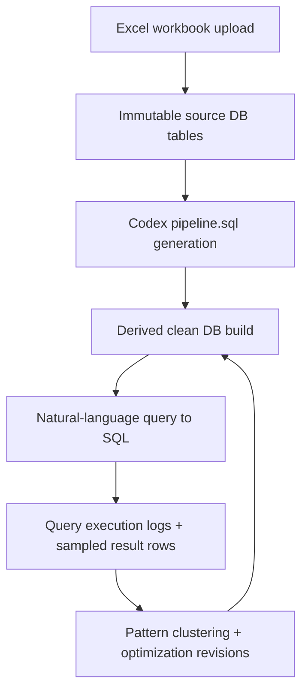

# Demo DB Walkthrough

Updated: 2026-03-19

Use this when you want to demo the system to technical audiences directly from SQLite.

For a presentation-style talk track with benchmark-backed messaging, see `docs/references/retail-demo-script.md`.

## High-level flow



Invariant: the source DB remains immutable; adaptation happens through derived clean DB rebuilds and pipeline revisions.

## Demo checkpoints

1. Show workbook sheets and source table mapping:

```sql
SELECT
  s.dataset_id,
  d.workbook_name,
  s.name AS sheet_name,
  s.source_table_name,
  s.sheet_order,
  json_extract(s.column_names_json, '$') AS columns
FROM source_sheets s
JOIN source_datasets d ON d.id = s.dataset_id
ORDER BY d.imported_at DESC, s.sheet_order ASC;
```

2. Show demo query logs:

```sql
SELECT
  query_log_id,
  source_dataset_id,
  prompt,
  status,
  row_count,
  total_latency_ms,
  generation_started_at
FROM query_execution_logs
ORDER BY generation_started_at DESC, query_log_id DESC
LIMIT 30;
```

3. Show learning loop state:

```sql
SELECT
  query_cluster_id,
  source_dataset_id,
  query_count,
  cumulative_execution_latency_ms,
  latest_optimization_decision
FROM query_clusters
ORDER BY cumulative_execution_latency_ms DESC, query_count DESC
LIMIT 20;

SELECT
  optimization_revision_id,
  source_dataset_id,
  decision,
  status,
  created_at,
  updated_at
FROM optimization_revisions
ORDER BY created_at DESC
LIMIT 20;
```

4. Show query results captured in DB:

```sql
SELECT
  query_log_id,
  source_dataset_id,
  prompt,
  row_count,
  result_column_names_json,
  result_rows_sample_json
FROM query_execution_logs
ORDER BY generation_started_at DESC, query_log_id DESC
LIMIT 20;
```

`result_rows_sample_json` stores up to 25 rows from each successful query to keep logs inspectable without bloating the source DB.

## Operator controls (API)

- Trigger optimization run now: `POST /api/optimization-runs/:datasetId`
- Trigger optimization run pinned to active baseline revision:
  - `POST /api/optimization-runs/:datasetId` with JSON body `{"basePipelineVersionId":"pipeline_version_..."}`.
- Retry latest failed optimization: `POST /api/optimization-retries/:datasetId`
- Rerun pipeline generation/build: `POST /api/imports/:datasetId/pipeline-rerun`
